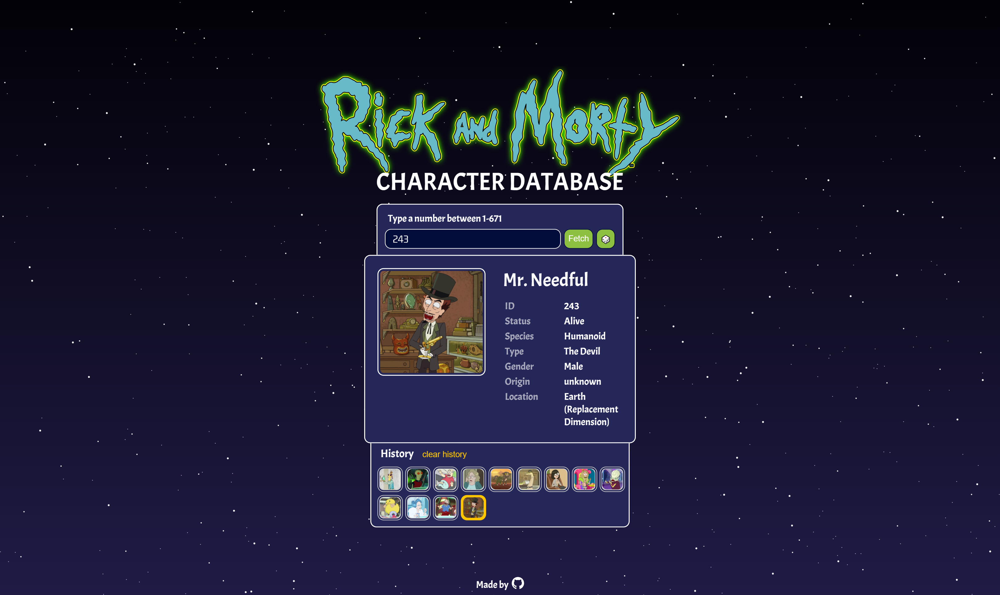

# Rick and Morty Character Database

Visit the app here:
https://kasparas-ban.github.io/rick-morty-character-database/

This is an example of a React app that allows you receive info about all the characters of the Rick and Morty show.

The source code is available on the [master](https://github.com/kasparas-ban/rick-morty-character-database/tree/master) branch.

This was done as an exercise to React tutorial: https://epic-react-exercises.vercel.app/react/advanced-hooks/2.

API used: https://rickandmortyapi.com/
